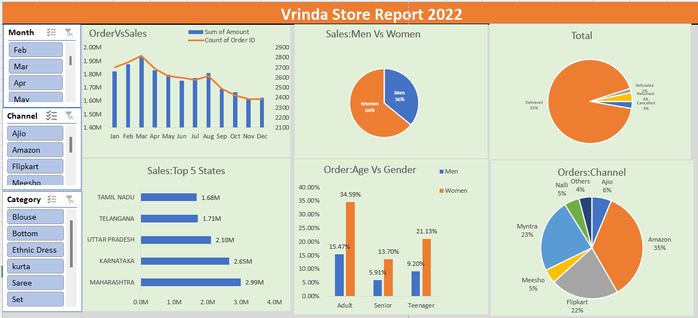

# Vrinda-Store-Report-2022
This project involved analyzing the 2022 sales data of Vrinda Stores to derive actionable business insights. The process began with an in-depth exploration of the dataset to identify and address key issues, including removing duplicate records and handling null values through data cleaning techniques. A pivot table was created to summarize the information, while charts and graphs were used for effective visualization of the trends.

An interactive Excel dashboard, equipped with slicers, was developed to enable dynamic exploration of the data. The analysis revealed valuable insights into customer purchasing behavior, such as gender-based buying trends, the performance of various sales channels, top-performing states, and the age-gender relationship in purchase patterns. Additionally, the highest-selling product category was identified.

📊 Insights Derived
Customer Demographics:

Women are more likely to purchase than men (~65%).
The age group 30-49 years contributes the most (~50%).
Top Performing Regions:

Maharashtra, Karnataka, and Uttar Pradesh are the top three states (~35%).
Sales Channels:

Online platforms such as Amazon, Flipkart, and Myntra account for the majority of sales (~80%).

📌 Conclusion
To improve sales, the focus should be on:

Target Audience:
Women aged 30-49 years.
Geographic Locations:
Maharashtra, Karnataka, and Uttar Pradesh.
Marketing Strategies:
Utilize ads, offers, and coupons on Amazon, Flipkart, and Myntra to engage the target audience effectively.

🚀 Key Features
Data-driven analysis of customer demographics and purchasing trends.
Identification of high-potential markets and sales channels.
Strategic recommendations to optimize marketing campaigns and boost sales.

